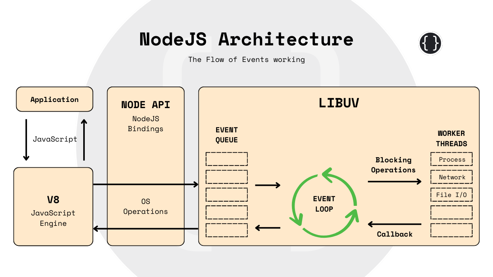

+++
date = '2024-11-05T23:16:37+05:30'
draft = false
title = 'Understanding Node.js Architecture'
summary = 'Node.js enables efficient server apps in JavaScript, using a non-blocking, event-driven model. With Google’s V8 engine and Libuv, it excels at handling asynchronous I/O, ideal for real-time, scalable applications. This article dives into its architecture and internal mechanics.'
category = 'NodeJS'
tags = ['JavaScript', 'Backend', 'V8 Engine', 'Libuv']
comments = true
cover = 'thumbnail.png'
reading_time = true
word_count = false
+++

Node.js has revolutionized server-side programming by enabling developers to write scalable, efficient server applications in JavaScript. Although it’s popular for its non-blocking, event-driven model, understanding its internal architecture gives us a deeper appreciation of why it performs so well and how it’s structured. This post will explore how Node.js is built, its main components, and the internal mechanics that make it a robust choice for backend development.


Node.js is an open-source, cross-platform JavaScript runtime environment. Its main distinction is its ability to execute JavaScript code on the server side, enabling full-stack development with a unified language. Node.js is particularly known for its non-blocking, asynchronous I/O operations and single-threaded, event-driven architecture, which contribute to its scalability and high performance.


## NodeJS Architecture
Let’s start by understanding the three main building blocks of Node.js: V8, Libuv, and Bindings.



### I. V8 JavaScript Engine
Node.js is built on top of the V8 JavaScript engine developed by Google for the Chrome browser. V8 is known for its high performance because it compiles JavaScript directly into machine code instead of interpreting it line by line. Here’s how V8 contributes to Node.js’s speed:
- **Just-In-Time (JIT) Compilation:** V8 uses JIT compilation to convert JavaScript into native machine code on the fly, making execution significantly faster.
- **Garbage Collection:** V8 comes with a garbage collector, which optimizes memory usage and ensures that unused objects don’t bloat memory.


### II. Libuv
**Libuv** is a C library responsible for Node.js’s asynchronous capabilities. It provides the event loop, handles non-blocking I/O operations, and manages system resources, like threads, for parallel processing. Here’s what libuv does:

- **Event Loop:** The core of Node’s asynchronous architecture, the event loop allows Node.js to handle multiple I/O operations simultaneously, even though it’s single-threaded.
- **Thread Pool:** While Node.js is single-threaded, it uses a thread pool (managed by Libuv) for tasks like file system operations or cryptographic functions, which can be offloaded to background threads.


### III. Node.js Bindings
Bindings are interfaces that allow JavaScript code to interact with lower-level C/C++ code. These bindings enable JavaScript to access the functions provided by V8 and Libuv. For example, when JavaScript makes a network request, the Node.js binding translates this into a Libuv API call that's executed asynchronously.

## How Node.js Works Internally
Node.js follows a single-threaded, event-driven architecture, which is quite different from traditional multi-threaded server models. Here’s how Node.js operates under the hood:

### a. The Event Loop
The event loop is a core concept in Node.js that allows it to handle asynchronous operations. The event loop is a process within Libuv that continuously monitors the status of asynchronous operations and executes the corresponding callbacks when operations are complete. Here’s how it works step-by-step:

- **Task Queues:** When an asynchronous operation (e.g., I/O request) is initiated, it’s sent to the appropriate system kernel or thread pool for execution, freeing the main thread to handle other requests.
- **Polling:** The event loop then polls for completed tasks. Once a task finishes, its callback is queued in the main thread.
- **Execution:** When the event loop has no other immediate tasks, it picks up and executes the callback, allowing it to handle tasks sequentially while appearing asynchronous.


In this way, Node.js can serve multiple requests concurrently, despite being single-threaded.

### b. Asynchronous I/O and Non-Blocking Operations
Node.js’s asynchronous, non-blocking nature allows it to handle I/O-bound tasks efficiently. Instead of waiting for I/O operations like database calls or file reads, Node.js offloads them to Libuv or the OS kernel, which processes them in the background. Once complete, they return to the event loop with the associated callback function.

```js
const fs = require('fs');

fs.readFile('file.txt', 'utf8', (err, data) => {
    if (err) throw err;
    console.log(data);
});

console.log("This runs before file read completes!");
```

Here, `readFile` is executed asynchronously. The event loop immediately moves to console.log("This runs before file read completes!") while the file read happens in the background.

### c. Callbacks, Promises, and Async/Await
In earlier versions of Node.js, callbacks were used extensively to handle asynchronous operations. However, callbacks can lead to deeply nested code, known as “callback hell.”

With ES6, Promises were introduced, followed by async/await in ES8, which are now common in Node.js to handle asynchronous code. These newer constructs make code more readable and maintainable, allowing developers to write asynchronous code in a synchronous style.

## The Build Process of Node.js
The Node.js build process is primarily in C++, and it uses a build toolchain to create the Node.js executable for different platforms.

#### a. GYP and CMake
Node.js uses GYP (Generate Your Projects) to generate platform-specific build files. GYP creates makefiles for Unix-based systems and project files for Visual Studio on Windows. CMake is also increasingly used as Node.js evolves.

#### b. Linking with V8 and Libuv
During the build, Node.js compiles the C++ codebase, which includes custom modules that extend JavaScript functionality, into native code. The V8 and Libuv libraries are then linked into the final binary, allowing Node.js to interact with both JavaScript execution and asynchronous I/O.

#### c. Compilation and Binaries
The final output of the build process is a single binary file that contains the Node.js runtime. This binary includes:

- The V8 engine (for JavaScript execution).
- The Libuv library (for asynchronous I/O).
- Node’s built-in modules (like HTTP, File System, etc.).

This binary allows Node.js to be run on multiple platforms without additional dependencies.

## Important Features Enabled by Node.js Architecture
Node.js’s unique architecture enables several powerful features that make it suitable for modern web applications.

#### a. High Scalability with Non-Blocking I/O
Node.js’s non-blocking, asynchronous nature makes it suitable for handling high concurrency. This is why it’s widely used for applications with a high volume of I/O operations, like real-time chat applications, REST APIs, and streaming platforms.

#### b. Microservices and Lightweight Containers
Node.js’s lightweight nature makes it ideal for microservices architectures. Many companies use Node.js within Docker containers, as each microservice can run in its own container, making it easy to scale and maintain.

#### c. Extensive Package Ecosystem (npm)
npm, the Node Package Manager, is one of the largest package ecosystems in the world. This ecosystem provides tools, frameworks, and libraries that extend Node.js’s capabilities, allowing developers to add almost any functionality to their applications with minimal effort.

## Limitations of Node.js
Node.js is a powerful runtime, but it’s not without its limitations:

- **Single-Threaded for CPU-Bound Tasks:** While Node.js can handle multiple I/O-bound tasks efficiently, CPU-bound tasks (like heavy computations) can slow down the main event loop.
- **Memory Management:** Node.js’s memory limits are more restrictive than those of some other server environments, which may be an issue for applications needing extensive in-memory processing.
Understanding Node.js's internals provides insights into why it performs so well for specific types of workloads. Its non-blocking, event-driven architecture, powered by V8 and Libuv, makes it an excellent choice for real-time applications, microservices, and I/O-heavy tasks. Although it has limitations, particularly with CPU-bound tasks, Node.js continues to grow in popularity due to its versatility and active community.

The more familiar you become with Node.js’s internals, the better equipped you’ll be to leverage its strengths and design applications that make the most of its architecture. With this foundational knowledge, you’re well on your way to mastering Node.js and building efficient, scalable server-side applications.

This article got a little complex at the end. Anyways, See ya 👋
